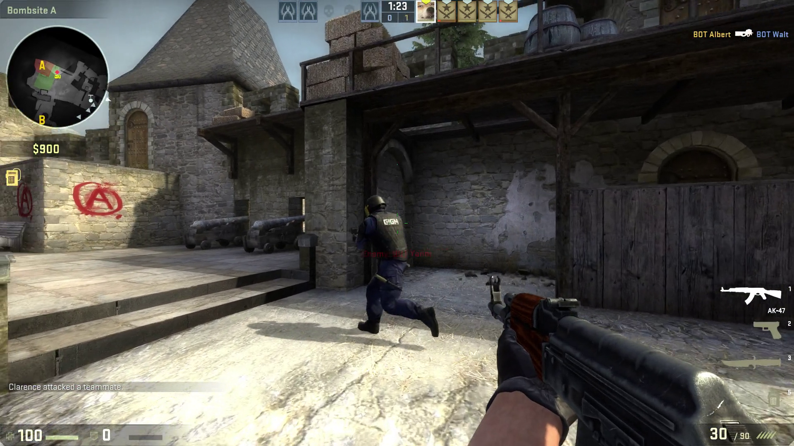

<div align="center">

# Teres

[](https://discord.gg/5z3YhWstQr) 
 
*Teres* is a program made to easily and efficiently add motion blur or frames to videos through frame blending and interpolation.

> **NOTE:** This program is unstable and is sub v1.0.0 so has lots of bugs and api/config changes will occur with its development

---

| Before | After |
| --- | --- |
|  |  |

</div>

*used default settings for the demo above from 60fps source file*

[](https://repology.org/project/teres/versions)

## Features

- Interpolate video to higher framerate
- Blur frames together for motion blur
- Both CLI and a minimal GUI usage
- Supports multiple videos simultatiously
- Progress bar
- Global configuration file
- Multithread and GPU support


## Installation

Currently teres is only able to be installed through Arch's AUR for linux


e.g with yay aur helper:

```bash
yay teres
```

for other platforms see [CONTRIBUTING.md](https://github.com/animafps/teres/tree/main/CONTRIBUTING.md) and download binaries from the releases or github action artifacts

## Usage

Without suppling arguments to the program it can be run through explorer and gui will guide selecting files

### CLI

```
USAGE:
    teres [OPTIONS] [INPUT]...

ARGS:
    [INPUT]...    Input file name(s) (space separated) or glob pattern

OPTIONS:
    -n, --noui       Disable user interface (CLI only)
    -v, --verbose... More output per occurence
    -q, --quiet...   Less output per occurence
    -h, --help       Print help information
    -V, --version    Print version information
```